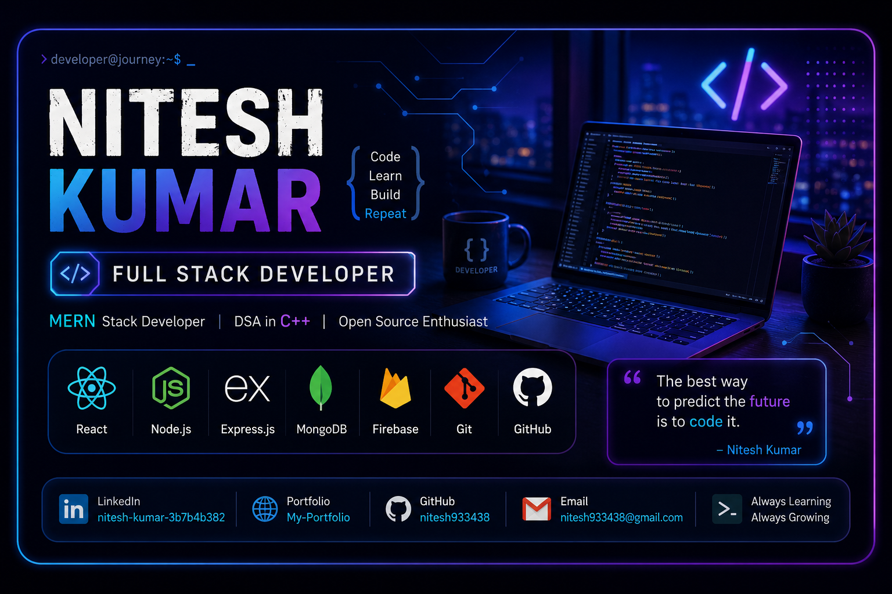
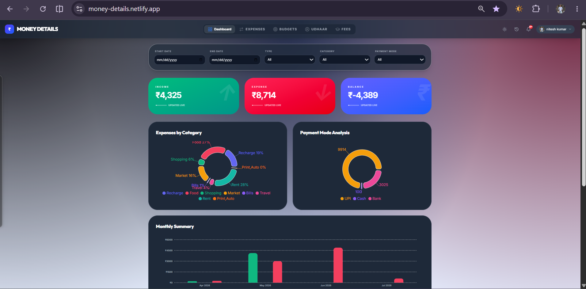
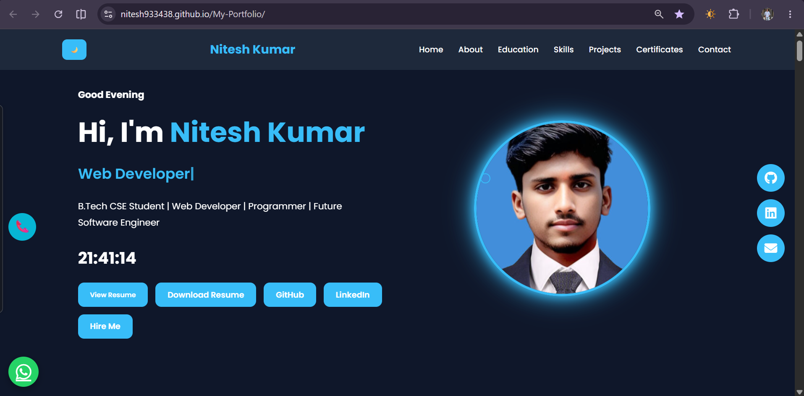

<h1 align="center">Hi 👋, I'm Nitesh Kumar</h1>

<h3 align="center">
Aspiring Full Stack Developer | MERN Stack Enthusiast | B.Tech CSE Student
</h3>

<p align="center">

</p>

<p align="center">

<a href="https://komarev.com/ghpvc/?username=nitesh933438">

</a>

<a href="https://github.com/nitesh933438?tab=followers">

</a>

<a href="https://github.com/nitesh933438">

</a>

</p>

<p align="center">

</p>

---

# 🚀 About Me


🎓 B.Tech Computer Science Student

💻 Passionate about Full Stack Web Development

🌱 Currently learning the MERN Stack ecosystem

📚 Solving Data Structures & Algorithms in C++

🔥 Building practical real-world projects

☁️ Exploring Firebase, Cloudinary & REST APIs

🎯 Goal: Become a Software Development Engineer

⚡ I enjoy building applications that solve real problems.

<br clear="right"/>

---

# 🌐 Connect With Me

<p align="center">

<a href="https://www.linkedin.com/in/nitesh-kumar-3b7b4b382">

</a>

<a href="https://nitesh933438.github.io/My-Portfolio/">

</a>

<a href="mailto:nitesh933438@gmail.com">

</a>

<a href="https://leetcode.com/u/nitesh933438/">

</a>

<a href="https://www.codechef.com/users/nitesh9334">

</a>

</p>

---

# 💻 Tech Stack

### 👨‍💻 Languages

<p>

</p>

### 🎨 Frontend

<p>

</p>

### ⚙️ Backend

<p>

</p>

### 🗄️ Database & Cloud

<p>

</p>

### 🛠️ Tools

<p>

</p>

---

# 📊 GitHub Analytics

<p align="center">


</p>

<p align="center">


</p>

---


# 🏆 GitHub Trophies

<p align="center">

</p>

---

# 📈 Contribution Graph

<p align="center">

</p>

---

# 🌟 Featured Projects

## 💰 Money Details

<p align="center">

</p>

## 🎥 Project Demo

<p align="center">

</p>

<p align="center">
<a href="https://money-details.netlify.app">

</a>

<a href="https://github.com/nitesh933438/Money-Details">

</a>
</p>

> **Money Details** is a modern Personal Finance Management System that helps users manage income, expenses, budgets, fee records, and udhaar with a beautiful, responsive interface.

### ✨ Features

- 📊 Dashboard Analytics
- 💰 Income & Expense Tracking
- 🎯 Budget Management
- 🤝 Udhaar Management
- 🎓 Fees Management
- 📈 Interactive Charts
- 📤 Export Data
- 🌙 Dark Mode
- 📱 Fully Responsive UI

**Tech Stack**

<p>

</p>

---

## 🌐 Personal Portfolio

<p align="center">

</p>

<p align="center">
<a href="https://nitesh933438.github.io/My-Portfolio/">

</a>
</p>

A modern portfolio website showcasing my projects, skills, achievements, and development journey.

---

# 🏅 Coding Profiles

<p align="center">

<a href="https://leetcode.com/u/nitesh933438/">

</a>

<a href="https://www.codechef.com/users/nitesh9334">

</a>

</p>

---

# 🎯 Current Focus

```text
🚀 Building Real World MERN Projects
📚 Solving DSA in Python 
🌱 Learning Backend Development
☁️ Exploring Firebase & Cloudinary
💼 Preparing for Software Development Internships
```

---

# 🎯 2026 Goals

- ✅ Master MERN Stack
- ✅ Solve 300+ DSA Problems
- ✅ Build 5+ Production-Level Projects
- ✅ Contribute to Open Source
- ✅ Secure a Software Development Internship
- ✅ Strengthen System Design Fundamentals

---

# 💬 Random Dev Quote

<p align="center">

</p>


---


# 🐍 Contribution Snake

<p align="center">
  
</p>

---

# 📈 GitHub Summary Cards

<p align="center">

</p>

<p align="center">


</p>

---

# ☕ Support Me

<p align="center">

If you like my work, don't forget to ⭐ my repositories.

</p>

---

# 🤝 Let's Connect

<p align="center">

<a href="mailto:nitesh933438@gmail.com">

</a>

<a href="https://www.linkedin.com/in/nitesh-kumar-3b7b4b382">

</a>

<a href="https://nitesh933438.github.io/My-Portfolio/">

</a>

<a href="https://github.com/nitesh933438">

</a>

</p>

---

<p align="center">


</p>
