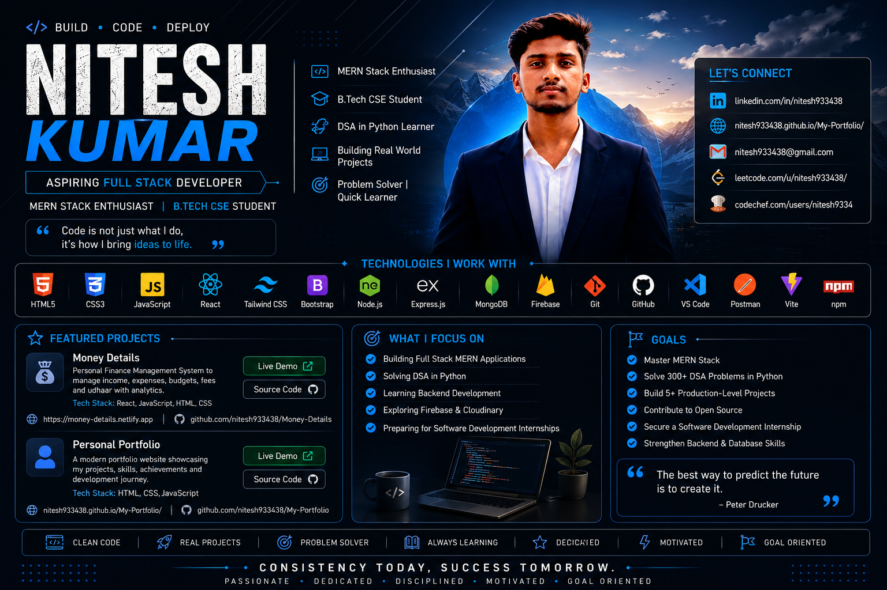
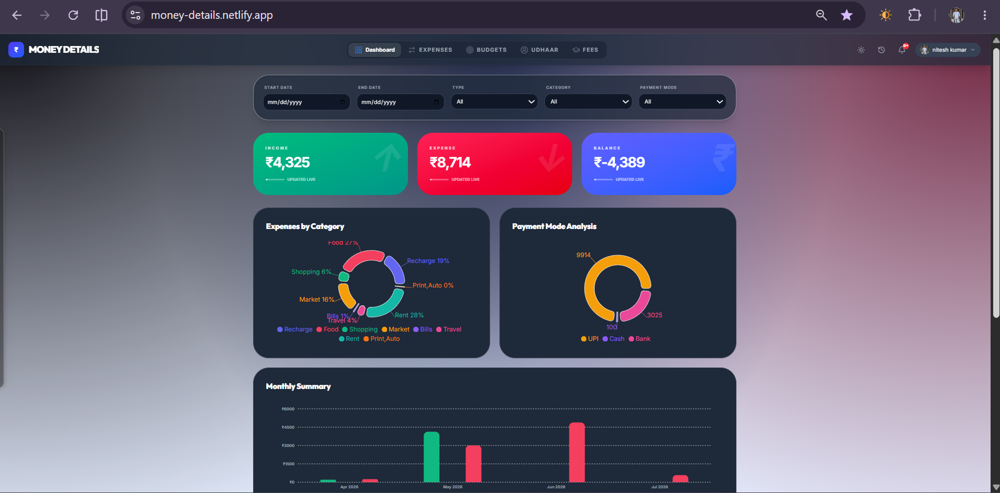
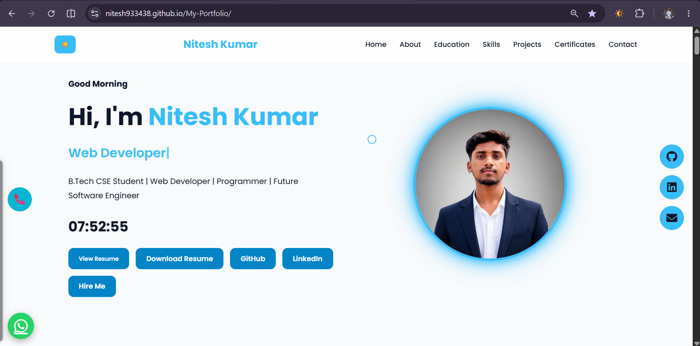

<h1 align="center">Hi 👋, I'm Nitesh Kumar</h1>

<h3 align="center">
Full Stack Developer | MERN Stack Enthusiast | B.Tech CSE Student
</h3>

<p align="center">

</p>

<p align="center">

<a href="https://komarev.com/ghpvc/?username=nitesh933438">

</a>

<a href="https://www.linkedin.com/in/nitesh933438">

</a>

<a href="https://nitesh933438.github.io/My-Portfolio/">

</a>

<a href="mailto:nitesh933438@gmail.com">

</a>

</p>

<p align="center">

</p>

---

# 🚀 About Me


🎓 **B.Tech Computer Science & Engineering Student (2nd Year)**

💻 Passionate about **Full Stack Web Development**

🚀 Building modern, scalable and responsive web applications

🐍 Solving **Data Structures & Algorithms using Python**

🌱 Continuously learning the **MERN Stack Ecosystem**

☁️ Exploring **Firebase, Cloudinary & REST APIs**

📂 Building real-world projects with modern UI/UX

🎯 Open to **Software Development Internship Opportunities**

⚡ Love turning ideas into useful applications through clean and efficient code.

<br clear="right"/>

---

# 🌐 Connect With Me

<p align="center">

<a href="https://www.linkedin.com/in/nitesh933438">

</a>

<a href="https://github.com/nitesh933438">

</a>

<a href="https://nitesh933438.github.io/My-Portfolio/">

</a>

<a href="mailto:nitesh933438@gmail.com">

</a>

<a href="https://leetcode.com/u/nitesh933438/">

</a>

<a href="https://www.codechef.com/users/nitesh9334">

</a>

</p>

---

# 💻 Tech Stack

### 👨‍💻 Programming Languages

<p>

</p>

### 🎨 Frontend Development

<p>

</p>

### ⚙️ Backend Development

<p>

</p>

### 🗄️ Database & Cloud

<p>

</p>

### 🛠️ Tools & Technologies

<p>

</p>

> 🚀 **Experienced in building responsive full-stack web applications using modern JavaScript technologies and continuously improving problem-solving skills through Python DSA.**

---


# 📊 GitHub Analytics

<p align="center">


</p>

<p align="center">


</p>

---

# 🏆 GitHub Trophies

<p align="center">

</p>

---

# 📈 Contribution Graph

<p align="center">

</p>

---

# 🌟 Featured Projects

## 💰 Money Details

<p align="center">

</p>

### 🎥 Project Demo

<p align="center">

</p>

<p align="center">

<a href="https://money-details.netlify.app">

</a>

<a href="https://github.com/nitesh933438/Money-Details">

</a>

</p>

### 📌 About Project

**Money Details** is a modern **Personal Finance Management System** built to help users efficiently manage their daily finances through a clean, fast and responsive interface.

### ✨ Key Features

- 📊 Dashboard Analytics
- 💰 Income & Expense Tracking
- 📝 Add, Edit & Delete Transactions
- 🎯 Budget Management
- 🤝 Udhaar Management
- 🎓 Fee Management
- 📂 Category Management
- 🔍 Search & Filter Records
- 📈 Interactive Charts & Reports
- 📤 Export Data
- 🔐 Firebase Authentication
- ☁️ Firestore Database
- 🌙 Dark Mode Support
- 📱 Fully Responsive Design

### 🛠️ Tech Stack

<p>


</p>

---

## 🌐 Personal Portfolio

<p align="center">

</p>

<p align="center">

<a href="https://nitesh933438.github.io/My-Portfolio/">

</a>

<a href="https://github.com/nitesh933438">

</a>

</p>

### 📌 About Portfolio

A modern, responsive portfolio website showcasing my projects, technical skills, certifications, achievements and development journey with a clean user experience.

---


# 🏅 Coding Profiles

<p align="center">

<a href="https://leetcode.com/u/nitesh933438/">

</a>

<a href="https://www.codechef.com/users/nitesh9334">

</a>

<a href="https://github.com/nitesh933438">

</a>

</p>

---

# 🎯 Current Focus

```text
🚀 Building Production-Ready MERN Stack Applications
🐍 Solving Data Structures & Algorithms using Python
🌱 Learning Backend Development & REST APIs
☁️ Exploring Firebase, Cloudinary & MongoDB
📚 Strengthening Problem Solving Skills
💼 Preparing for Software Development Internships
```

---

# 🎯 2026 Goals

- ✅ Master MERN Stack Development
- ✅ Solve 300+ DSA Problems in Python
- ✅ Build 5+ Production-Level Projects
- ✅ Contribute to Open Source
- ✅ Learn System Design Fundamentals
- ✅ Secure a Software Development Internship
- ✅ Improve Backend Development Skills

---

# 💬 Random Dev Quote

<p align="center">


</p>

---

# 🐍 Contribution Snake

<p align="center">


</p>

---

# 📈 GitHub Summary Cards

<p align="center">


</p>

<p align="center">


</p>

---

# 📌 Currently Exploring

- ⚛️ Advanced React.js
- 🟢 Node.js & Express.js
- 🍃 MongoDB
- 🔥 Firebase Services
- 🐍 Python Programming
- 📊 Data Structures & Algorithms
- 🌐 REST API Development
- ☁️ Cloud-Based Applications

---

# 🤝 Let's Connect

<p align="center">

<a href="mailto:nitesh933438@gmail.com">

</a>

<a href="https://www.linkedin.com/in/nitesh933438">

</a>

<a href="https://nitesh933438.github.io/My-Portfolio/">

</a>

<a href="https://github.com/nitesh933438">

</a>

</p>

---

<p align="center">

### ⭐ Thanks for visiting my GitHub Profile!

*"Code • Learn • Build • Improve • Repeat"* 🚀


</p>